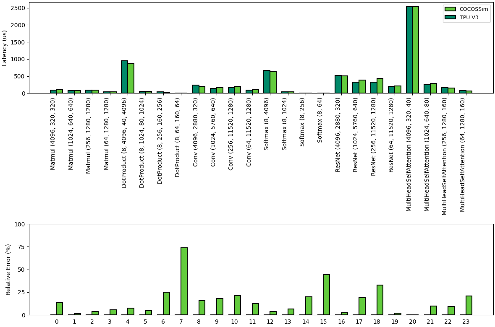

# COCOSSim: A Holistic Simulator for Modern Neural Network Architectures

## Overview

**COCOSSim** is a cycle-accurate performance simulator designed for evaluating architectural and microarchitectural modifications in heterogeneous systolic array-based accelerators. Performance modeling is an essential tool for enabling cost-effective and efficient exploration of architectural design decisions for hardware development, particularly for contemporary machine learning workloads.

COCOSSim addresses critical limitations in existing simulators by providing:
- **Architectural flexibility** for heterogeneous accelerator designs
- **Comprehensive memory hierarchy modeling** with DRAMSim3 integration
- **Modern ML workload support** including non-linear operations like softmax and vectorized activations
- **PyTorch frontend** for seamless model integration
- **Flexible scheduling strategies** and microarchitectural modifications

## Key Features

### Architecture Support
- **Systolic Arrays**: Output Stationary (default) and Weight Stationary dataflows
- **Vector Units**: SIMD operations with configurable multi-pass support
- **Heterogeneous Design**: Seamless integration of systolic arrays with vector units
- **Memory Modeling**: Full integration with DRAMSim3 for realistic memory hierarchy simulation

### Supported Operations
#### Matrix Operations
- **Matrix Multiplication (GEMM)**: Configurable M×K×N dimensions
- **Convolution**: Conv2D operations with flexible kernel configurations
- **Fused Operations**: Matrix multiplication with activations (planned)

#### Activations & Non-linear Operations
- **Softmax**: Multi-phase vector unit implementation
- **ReLU**: Linear activation functions
- **Layer Normalization**: Full layer norm support
- **Batch Normalization**: Batch processing normalization

### Performance & Validation
- **13% average error rate** when validated against Google TPU v3
- **Order of magnitude faster** simulation speeds compared to prior work
- **Highly scalable** architecture simulation
- **Cycle-accurate** modeling for detailed performance analysis


*COCOSSim validation results compared to Google TPU v3 hardware measurements, demonstrating high accuracy across diverse neural network workloads.*

## Architecture Overview

*COCOSSim Architecture*

## Installation

### Prerequisites
- **C++17** compatible compiler (GCC 7+ or Clang 5+)
- **CMake 3.10** or higher
- **Git** for submodule management

### Quick Start
```bash
# Clone the repository
git clone https://github.com/mc186/cocossim.git
cd cocossim

# Initialize DRAMSim3 submodule
git clone --recursive https://github.com/umd-memsys/DRAMsim3.git dramsim3
# Alternative: use the setup script
./setup_dramsim.sh

# Build the project
mkdir build && cd build
cmake ..
make -j$(nproc)
```

### Build Options
```bash
# Enable VCD waveform dumping for debugging
cmake -DUSE_VCD=ON ..
```

## Usage

### Basic Simulation
```bash
# Standard neural network simulation
./perf_model -c 1 -sa_sz 64 -sz_vu 64 -f 1 -i layers.txt -o results.txt

# Weight Stationary mode
./perf_model -c 1 -sa_sz 64 -sz_vu 64 -ws 1 -f 1 -i layers.txt -o results.txt
```

### Command Line Options

#### Global Options
- `-i <file>`: Input layer configuration file (required)
- `-o <file>`: Output statistics file (required)  
- `-f <float>`: Operating frequency in GHz
- `-h`: Display help information

#### Architecture-Specific Options
- `-c <int>`: Number of compute cores
- `-sa_sz <int>`: Systolic array size (e.g., 64 for 64×64 array)
- `-sz_vu <int>`: Vector unit size
- `-ws <0|1>`: Dataflow mode (0=Output Stationary, 1=Weight Stationary)

### Layer Configuration Format

Create a `layers.txt` file with operation specifications:

```txt
# Basic matrix multiplication: M K N
Matmul 128 128 128

# Multi-dimensional operations: operation dim1 dim2 dim3 dim4
Matmul 32 512 1024 64

# Activation functions
Softmax 1024
ReLU 512 512

# Normalization layers
LayerNorm 768 128
BatchNorm 256 64 64
```

#### Layer Types Supported
- **`Matmul`**: Matrix multiplication with flexible dimensions
- **`Conv`**: Convolution operations
- **`Softmax`**: Softmax activation with multi-phase vector processing  
- **`Activations`**: SiLU, ReLU, etc.
- **`LayerNorm`**: Layer normalization

## Example Use Cases
```bash
# Compare Output Stationary vs Weight Stationary
./perf_model -c 1 -sa_sz 64 -sz_vu 64 -ws 0 -f 1 -i model.txt -o os_results.txt
./perf_model -c 1 -sa_sz 64 -sz_vu 64 -ws 1 -f 1 -i model.txt -o ws_results.txt

# Compare different array sizes
./perf_model -c 1 -sa_sz 32 -sz_vu 32 -f 1 -i model.txt -o small_results.txt
./perf_model -c 1 -sa_sz 128 -sz_vu 128 -f 1 -i model.txt -o large_results.txt
```

## Output Analysis

The simulator generates detailed performance statistics:

```txt
Cycles 1247832                    # Total simulation cycles
SystolicArray 0.847291           # Utilization percentage
VectorUnit 0.234567              # Vector unit utilization  
MemorySystem 0.123456            # Memory system activity

Drain Ratio: 0.89                # Performance efficiency metric
```

### Key Metrics
- **Cycles**: Total clock cycles for workload completion
- **Unit Utilization**: Percentage of time each component is active
- **Drain Ratio**: Efficiency metric comparing actual vs theoretical performance
- **Memory Statistics**: Detailed memory access patterns and latencies

## Advanced Features

### Memory System Configuration
COCOSSim integrates with DRAMSim3 for realistic memory modeling:
- **Configurable DRAM types**: DDR4, DDR5, HBM, etc.
- **Memory controller modeling**: Queue depths, scheduling policies
- **Bandwidth and latency modeling**: Realistic memory hierarchy performance

### Scheduling Strategies
- **Time-based enqueueing**: Configurable job scheduling
- **Dependency management**: Automatic handling of layer dependencies
- **Load balancing**: Distribution across multiple compute units

## Case Studies

### 1. Model Parallelism Analysis
COCOSSim enables evaluation of different parallelization strategies:
- **Data parallelism**: Multiple batches across cores
- **Model parallelism**: Layer distribution across compute units
- **Pipeline parallelism**: Overlapped layer execution

### 2. Operation Fusion Optimization
Evaluate the benefits of fusing operations:
- **GEMM + Activation**: Matrix multiplication with immediate activation
- **Multi-layer fusion**: Combining multiple operations in single pass
- **Memory access optimization**: Reduced intermediate storage requirements

## Contributing

We welcome contributions to COCOSSim! Please follow these guidelines:

1. **Fork the repository** and create a feature branch
2. **Follow existing code style** and include appropriate documentation
3. **Add tests** for new functionality where applicable
4. **Submit pull requests** with clear descriptions of changes

## Citation

If you use COCOSSim in your research, please cite our work:

```bibtex
@inproceedings{choudhary2025cocossim,
  title={COCOSSim: A Cycle-Accurate Simulator for Heterogeneous Systolic Array Architectures},
  author={Choudhary, Mansi and Kjellqvist, Chris and Ma, Jiaao and Wills, Lisa Wu},
  booktitle={2025 IEEE International Symposium on Performance Analysis of Systems and Software (ISPASS)},
  pages={174--185},
  year={2025},
  organization={IEEE}
}
```
## Acknowledgments

- **DRAMSim3**: Memory system simulation framework
- **Google TPU**: Validation reference architecture
---
